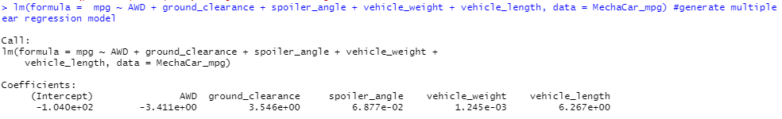
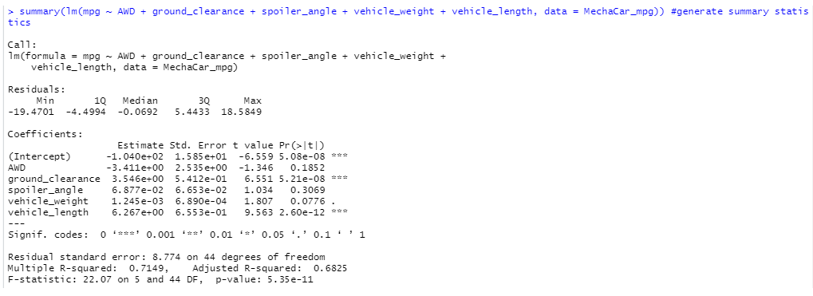
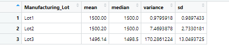
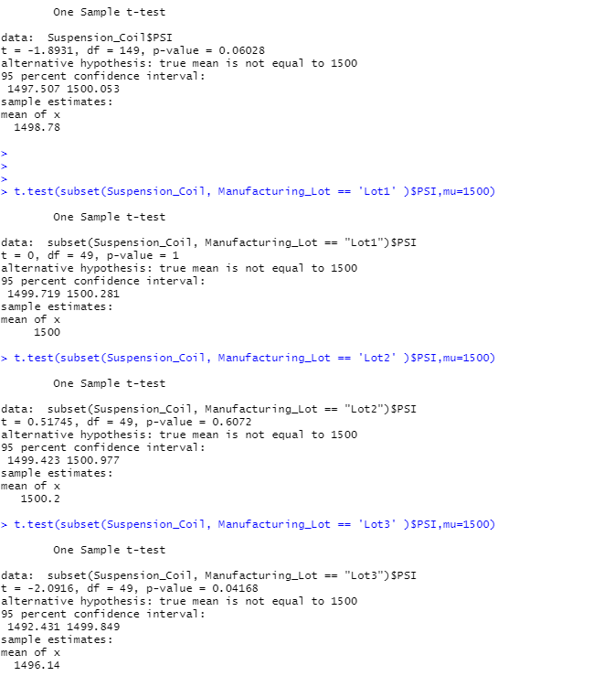

# MechaCar_Statistical_Analysis-

## Linear Regression to Predict MPG
The MechaCar_mpg.csv dataset contains mpg test results for 50 prototype MechaCars. The MechaCar prototypes were produced using multiple design specifications to identify ideal vehicle performance. Multiple metrics, such as vehicle length, vehicle weight, spoiler angle, drivetrain, and ground clearance, were collected for each vehicle. We were tasked 
to find out which variables/coefficients provided a non-random amount of variance to the mpg values in the dataset.

First, we created the dataframe using out LM fuctions in R. We were able see the outcomes that help us determine our variances outcomes. 
As you can see by the outcome below. Vehicle_length and ground_clearance had the most random variance. Our Outcome has also shown us that the slope
of the linear model is not zero because of our p value which is 5.35.

Finally, our linear model predict mpg of MechaCar prototypes does not predict our prototypes effectivly because of our 71% outcome. We do know from this 
that we will have a 71% accuracy with our prototypes.

## Summary Statistics on Suspension Coils

The design specifications for the MechaCar suspension coils dictate that the variance of the suspension coils must not exceed 100 pounds per square inch. Based on our outcome below we see that the variance does meet this design specification for 2 of our lots but not lot 3. Our lot 3 variance is above the 100 pounds per square inch at 170.2. However, out total summary is below our 100 pound guide line. 

## T-Tests on Suspension Coils

This summary shows us that our results are favorable in 2 of or lots. For example, Lot 1 and Lot 2 is on par or very close to our 1500 mark. However as we can see
Lot 3 is statistically different from the population meanof 1500 pounds per square inch.

 ## Study Design: MechaCar vs Competition.
 
 Based on our research car buyers are generally interested in specific metrics that would help on budget. For example, highway fuel efficiency or maintaince cost go into 
 consumer desision making. Using our tests we can see how MechaCar stands up to its competitors in these areas. We can have a null hypothesis that states MechaCar test on consumer purchasing cars based on fuel efficiency and safety rating on specific cars is the same as it's competitors. We can also use the alternative that states MechaCar test on consumer purchasing cars based on fuel efficiency and safety rating on specific cars is superior. We would have to run our t-test on our competitors for those specifications
 and also for all our competitor cars. With these results we would be able to prove out our Hypotheseis. 
 
 

